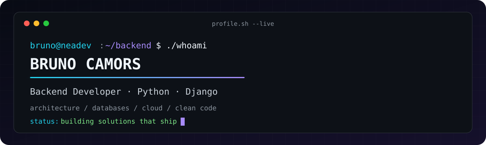
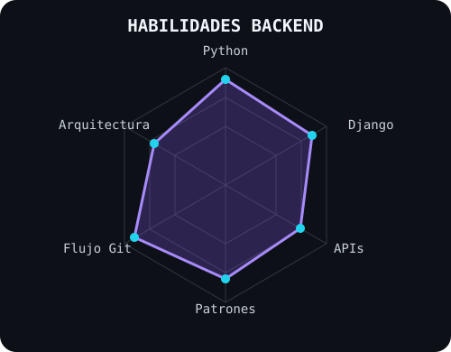
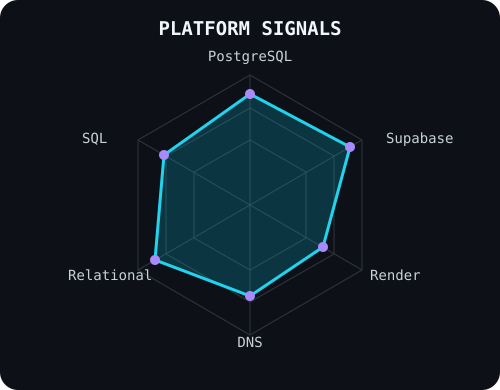

<picture>
  <source media="(prefers-color-scheme: dark)" srcset="assets/banner-dark.svg">
  <source media="(prefers-color-scheme: light)" srcset="assets/banner-light.svg">
  
</picture>

 

 

&nbsp;&nbsp;

 

---

## This is me :)

Hi, I'm **Bruno Camors**, backend developer and cofounder of **NeaDev**, based in Chaco, Argentina 🇦🇷. I design the systems behind digital products: APIs, business logic, relational data models and production deployments.

- 🧱 I build **modular backend architectures** with Python and Django, applying patterns such as Factory, Repository and Strategy.
- 🗄️ I model and manage relational data with **PostgreSQL, Supabase and SQL**.
- ☁️ I deploy applications on **Render** and manage production domains and DNS records.
- 🤝 I coordinate collaborative development through **Git, GitHub, code reviews and branching workflows**.
- 🎓 I'm pursuing a **Higher Technical Degree in Software Development** at Instituto Educativo Económico Nacional.
- 🌱 My goal is to turn real problems into maintainable software that reaches production.

 

## my perfect stack`

  

---

## signals

<table>
<tr>
<td width="50%" align="center" valign="middle">
  
</td>
<td width="50%" align="center" valign="middle">
  
</td>
</tr>
</table>

---

## things I've built

- 🌳 **Ojo del Monte - hackIAthon 2026:** backend API for real-time deforestation detection and monitoring through satellite image processing.
- 💼 **[IEN Empleo](https://github.com/Deathstone16/BolsaTrabajo):** Django employment platform with AI-assisted matching between candidates and job opportunities.
- 🍽️ **[Don Appétit](https://github.com/Deathstone16/donapetit2):** donation management backend for orders, donors and delivery operations.
- 📷 **Foto Alex:** commercial WordPress platform with a dynamic catalogue and custom administration panel.

---

## Numbers matter? ohhh yes.

 

---

` Building backend systems with purpose · @Deathstone16 `

