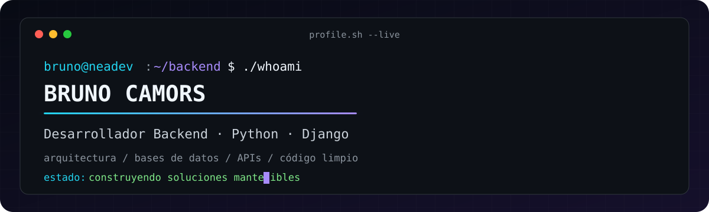
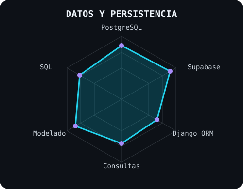

<picture>
  <source media="(prefers-color-scheme: dark)" srcset="assets/banner-dark-v2.svg">
  <source media="(prefers-color-scheme: light)" srcset="assets/banner-light-v2.svg">
  
</picture>

 

 

&nbsp;&nbsp;

---

## Este soy yo :)

Hola, soy **Bruno Camors**, desarrollador backend y cofundador de **NeaDev**, de Chaco, Argentina 🇦🇷. Diseño los sistemas que impulsan productos digitales: APIs, lógica de negocio y modelos de datos relacionales.

- 🧱 Construyo **arquitecturas backend modulares** con Python y Django, aplicando patrones de Fábrica, Repositorio y Estrategia.
- 🗄️ Modelo y administro datos relacionales con **PostgreSQL, Supabase y SQL**.
- 🤝 Trabajo de forma colaborativa mediante **Git, GitHub, revisiones de código y flujos de ramas**.
- 🎓 Curso la **Tecnicatura Superior en Desarrollo de Software** en el Instituto Educativo Económico Nacional.
- 🌱 Mi objetivo es transformar problemas reales en software claro, mantenible y útil.

 

## mis tecnologías principales`

  

---

## habilidades

<table>
<tr>
<td width="50%" align="center" valign="middle">
  
</td>
<td width="50%" align="center" valign="middle">
  
</td>
</tr>
</table>

---

## proyectos que desarrollé

- 🌳 **Ojo del Monte - hackIAthon 2026:** API backend para detectar y monitorear la deforestación mediante el procesamiento de imágenes satelitales.
- 💼 **[IEN Empleo](https://github.com/Deathstone16/BolsaTrabajo):** plataforma laboral desarrollada con Django y emparejamiento asistido por inteligencia artificial entre postulantes y vacantes.
- 🍽️ **[Don Appétit](https://github.com/Deathstone16/donapetit2):** backend para administrar donaciones, pedidos, donadores y operaciones de entrega.
- 📷 **Foto Alex:** plataforma comercial en WordPress con catálogo dinámico y panel de administración personalizado.

---

` Construyendo sistemas backend con propósito · @Deathstone16 `

